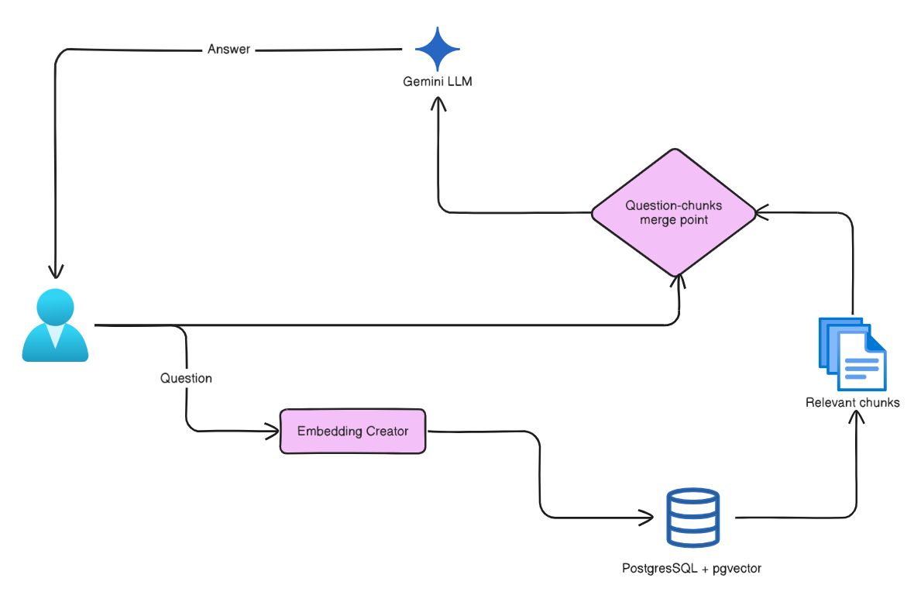

# 📄 Gemini Document Q&A - RAG Application

A lightweight Retrieval-Augmented Generation (RAG) application that enables intelligent document Q&A using Google Gemini AI. Upload documents (PDF or TXT), and ask questions about their content with context-aware AI-powered responses.

---

## ✨ Features

- **📤 Document Upload**: Support for TXT and PDF files with intelligent content extraction
- **🔍 Semantic Search**: Retrieve contextually relevant document chunks using vector embeddings
- **🤖 AI-Powered Answers**: Get accurate responses using Google Gemini with retrieved context
- **🌐 Modern Web UI**: Clean, responsive interface with dark mode support
- **⚡ Background Processing**: Asynchronous document chunking and embedding generation
- **🔐 Vector Database**: PostgreSQL with pgvector extension for semantic search
- **📊 Multi-Format Support**: PDF text extraction with OCR fallback, TXT file parsing

---

## 🏗️ Architecture



### Key Components

| Component | Purpose |
|-----------|---------|
| **main.py** | FastAPI application with endpoints for upload, ask, and retrieval |
| **db.py** | SQLAlchemy ORM models for `File` and `FileChunk` with vector storage |
| **file_parser.py** | Factory pattern parsers for TXT/PDF extraction with OCR support |
| **background_tasks.py** | TextProcessor for chunking text and generating embeddings |
| **index.html** | Interactive web interface with upload and Q&A functionality |

---

## 🛠️ Tech Stack

- **Backend**: FastAPI, Python 3.10+
- **Database**: PostgreSQL with pgvector extension (Supabase recommended)
- **AI Models**: 
  - Google Gemini 2.5 Flash Lite (question answering)
  - Sentence Transformers all-MiniLM-L6-v2 (embeddings)
- **Frontend**: HTML5, CSS3, JavaScript (Vanilla)
- **Document Processing**: PyPDF2, Pytesseract, PyMuPDF, NLTK
- **ORM**: SQLAlchemy

---

## 📋 Prerequisites

- Python 3.10+
- PostgreSQL database with pgvector extension
- Google Generative AI API key
- Tesseract OCR (for PDF text extraction fallback)

---

## 🚀 Setup & Installation

### 1. Clone and Navigate to Project

```bash
git clone <your-repo-url>
cd simple-RAG-application
```

### 2. Create Virtual Environment

```bash
python -m venv venv
.\venv\Scripts\Activate.ps1  # Windows PowerShell
```

### 3. Install Dependencies

```bash
pip install -r requirements.txt
```

### 4. Install Tesseract OCR (Windows)

```bash
# Download installer from: https://github.com/UB-Mannheim/tesseract/wiki
# Or use Chocolatey:
choco install tesseract
```

Update the Tesseract path in `file_parser.py` if installed elsewhere:

```python
pytesseract.pytesseract.tesseract_cmd = r'C:\Program Files\Tesseract-OCR\tesseract.exe'
```

### 5. Configure Environment Variables

Create a `.env` file in the project root:

```env
# Google Gemini API
GEMINI_API_KEY=your-google-api-key-here
GEMINI_MODEL_NAME=gemini-2.5-flash-lite

# PostgreSQL / Supabase
POSTGRES_USERNAME=postgres_user
POSTGRES_PASSWORD=your_secure_password
POSTGRES_HOST=your-instance.supabase.co
POSTGRES_PORT=5432
DATABASE_NAME=postgres
```

**Get your API keys:**
- [Google Generative AI](https://aistudio.google.com/app/apikey)
- [Supabase PostgreSQL](https://supabase.com/)

### 6. Run the Application

```bash
uvicorn main:app --reload
```

The app will be available at `http://localhost:8000`

---

## 📚 API Endpoints

### GET `/`
Serves the web UI.

**Response**: HTML page with upload and Q&A interface

---

### GET `/get-uploaded-files/`
Retrieve all uploaded files from the database.

**Response**:
```json
[
  {
    "file_id": 1,
    "file_name": "document.pdf"
  }
]
```

---

### POST `/uploadfile/`
Upload and process a document (TXT or PDF).

**Request**:
- `file` (form-data): Document file (max size: as per server config)

**Response**:
```json
{
  "info": "✅ File 'document.pdf' uploaded and processing started",
  "file_id": 1
}
```

**Processing Flow**:
1. File saved to `sources/` folder
2. Content extracted using appropriate parser
3. File metadata stored in database
4. Background task initiated for chunking & embedding

---

### POST `/ask/`
Ask a question about an uploaded document.

**Request**:
```json
{
  "document_id": 1,
  "question": "What is the main topic of this document?"
}
```

**Response**:
```json
{
  "response": "The document primarily discusses..."
}
```

**Processing Flow**:
1. Retrieve top 10 semantically similar chunks using vector similarity
2. Concatenate chunks as context
3. Send context + question to Gemini API
4. Return AI-generated answer

---

### POST `/find-similar-chunks/{file_id}`
Debug endpoint: Find similar chunks without AI generation.

**Request**:
```json
{
  "question": "search query"
}
```

**Response**:
```json
[
  {
    "chunk_id": 1,
    "chunk_text": "Relevant text excerpt..."
  }
]
```

---

## 💾 Database Schema

### `files` Table
| Column | Type | Description |
|--------|------|-------------|
| `file_id` | INTEGER (PK) | Unique identifier |
| `file_name` | VARCHAR(255) | Original filename |
| `file_content` | TEXT | Complete file text |

### `file_chunks` Table
| Column | Type | Description |
|--------|------|-------------|
| `chunk_id` | INTEGER (PK) | Unique identifier |
| `file_id` | INTEGER (FK) | Reference to parent file |
| `chunk_text` | TEXT | Chunk content (2 sentences) |
| `embedding_vector` | Vector(384) | Semantic embedding |

---

## 🔄 Processing Workflow

```
User Uploads Document
        ↓
File Parser (TXT/PDF/OCR)
        ↓
Store File & Content in DB
        ↓
Background Task: TextProcessor
        ├─ Split into Sentences (NLTK)
        ├─ Group into Chunks (2 sentences)
        ├─ Generate Embeddings (SentenceTransformer)
        └─ Store in Vector DB
        ↓
Ready for Q&A
```

### Question Processing

```
User Asks Question
        ↓
Generate Question Embedding
        ↓
Vector Similarity Search (L2 Distance)
        ├─ Retrieve Top 10 Chunks
        └─ Concatenate as Context
        ↓
Call Gemini API with Context
        ↓
Return Formatted Answer to User
```

---


## 🎨 UI Features

- **Upload Section**: File selection and upload with status feedback
- **Question Section**: Text input for questions with markdown-rendered answers
- **Dark Mode**: Theme toggle button (bottom-right)
- **Responsive Design**: Works on desktop and tablet
- **Real-time Status**: Upload and processing feedback

---

## ⚙️ Configuration

### Model Settings

Modify in `.env`:
```env
GEMINI_MODEL_NAME=gemini-2.5-flash-lite  # or gemini-pro, etc.
```

### Chunk Size

Adjust in `background_tasks.py`:
```python
self.chunk_size = 2  # Number of sentences per chunk
```

### Embedding Model

Change in `background_tasks.py` and `main.py`:
```python
self.model = SentenceTransformer('all-MiniLM-L6-v2')
```

### Top-K Chunks

Modify in `main.py`:
```python
.limit(10)  # Change to retrieve different number of chunks
```

---

## 📦 Dependencies

| Package | Purpose |
|---------|---------|
| `fastapi` | Web framework |
| `python-dotenv` | Environment configuration |
| `google-generativeai` | Gemini API client |
| `SQLAlchemy` | ORM |
| `pgvector` | PostgreSQL vector operations |
| `sentence-transformers` | Embedding generation |
| `PyPDF2` | PDF text extraction |
| `pytesseract` | OCR for images |
| `PIL` | Image processing |
| `PyMuPDF` | Advanced PDF handling |
| `nltk` | Text processing & tokenization |

---

## 🚨 Troubleshooting

### Tesseract Not Found
- Install Tesseract from [here](https://github.com/UB-Mannheim/tesseract/wiki)
- Update path in `file_parser.py`

### Database Connection Error
- Verify `.env` credentials
- Ensure pgvector extension: `CREATE EXTENSION IF NOT EXISTS vector;`
- Check network connectivity to Supabase

### API Key Invalid
- Verify `GEMINI_API_KEY` in `.env`
- Regenerate from [Google AI Studio](https://aistudio.google.com/)

### Upload Fails
- Check file size limits
- Ensure file is TXT or PDF
- Verify `sources/` folder exists and is writable

### Slow Responses
- Monitor database indexes on `embedding_vector`
- Consider increasing `--workers` in Uvicorn
- Profile with Gemini API rate limits

---

## 📝 Usage Example

1. **Start Server**
   ```bash
   uvicorn main:app --reload
   ```

2. **Open Browser**
   Navigate to `http://localhost:8000`

3. **Upload Document**
   - Click on file input, select TXT or PDF
   - Click "Upload" button
   - Wait for processing confirmation

4. **Ask Questions**
   - Enter question in text field
   - Click "Ask" button
   - View AI-generated answer with document context

---


**Built with ❤️ - Intelligent Document Q&A**
